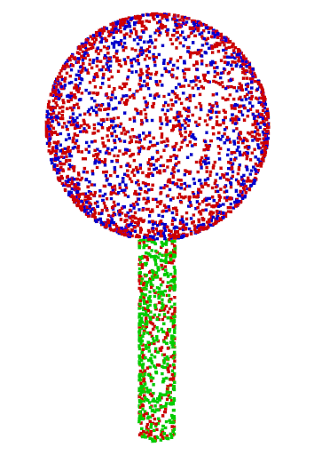
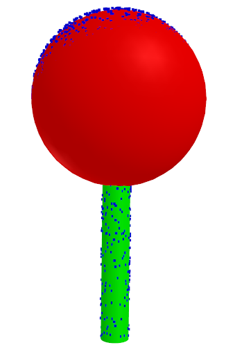
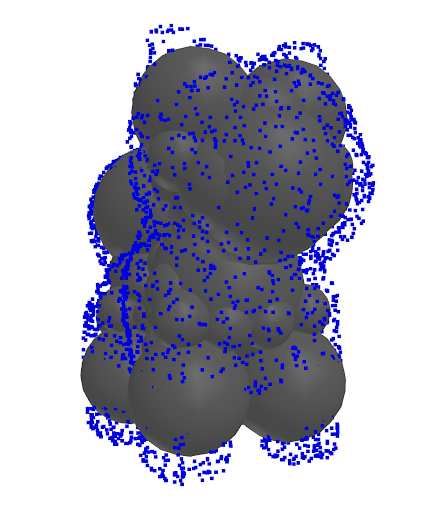
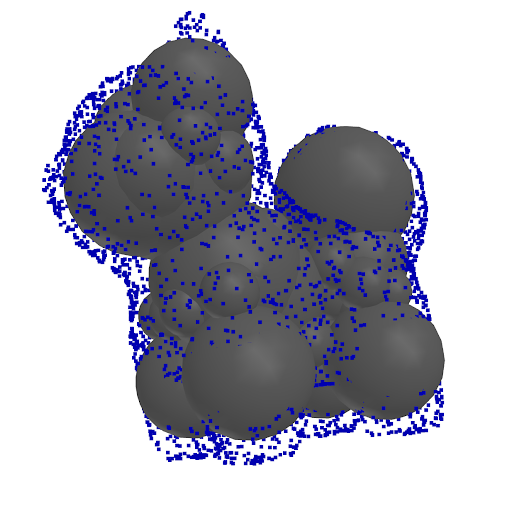
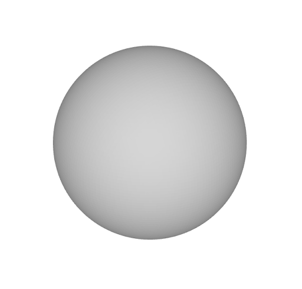
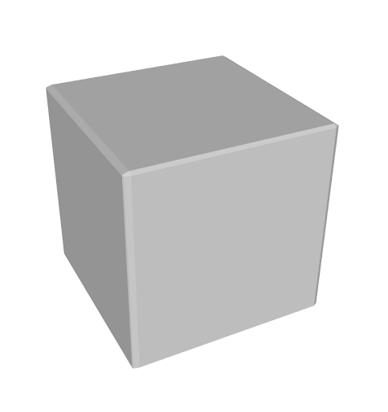
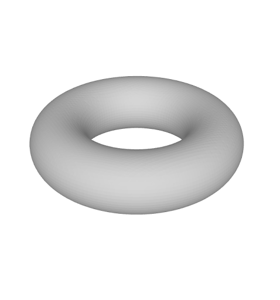
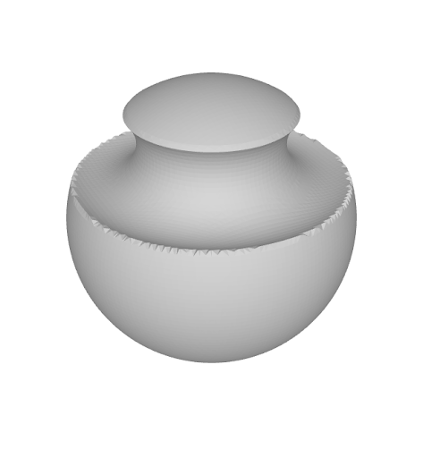
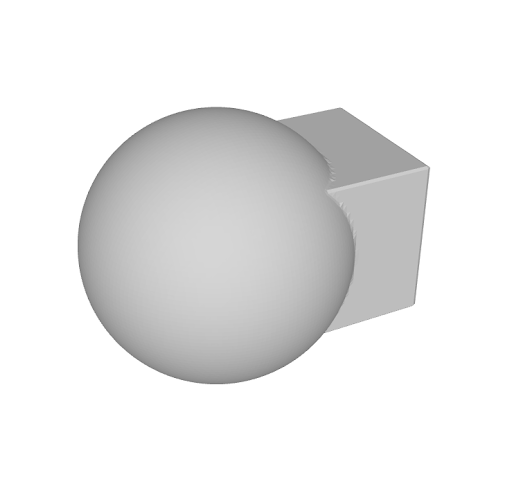
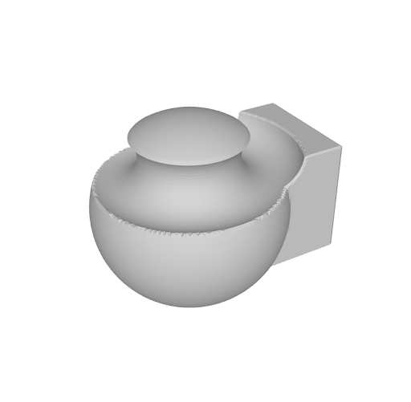

# CMPT 464 Assignment: 3D Shape Processing

This project contains four main tasks focused on 3D shape analysis, registration, and abstraction using classical and deep learning methods. Each task is implemented in a separate Python file.

## Tasks Overview

### 1. Point Cloud Registration using ICP
Implemented Iterative Closest Point (ICP) algorithm for aligning 3D point clouds. The script includes dynamic visualization of registration steps.

**Result Example:**


### 2. Primitive Parameter Optimization with RANSAC
Used RANSAC and least squares optimization to fit geometric cylinder and sphere primitives to point cloud data. The script provides mesh creation and visualization utilities.

**Result Example:**


### 3. Shape Abstraction with Neural Networks
Utilized neural networks (e.g., DGCNN) for abstracting shapes from point clouds. Implemented signed distance field (SDF) queries for primitive shapes.

**Result Examples:**
<p float="left">
	
	
</p>

### 4. Constructive Solid Geometry (CSG) Operations with Primitives
Performs CSG operations (union, intersection, difference) using primitive SDFs. Included mesh generation and visualization.

**Result Examples:**
<p float="left">
	
	
	
	
	
	
	
</p>

## Requirements
- Python 3.8+
- numpy
- scipy
- trimesh
- matplotlib
- torch
- mcubes

Install dependencies with:
```bash
pip install numpy scipy trimesh matplotlib torch mcubes
```

## Usage
Run each task independently:
```bash
python point_cloud_registration_icp.py
python primitive_parameter_optimization_ransac.py
python shape_abstraction_neural_networks.py
python csg_operations_primitives.py
```
